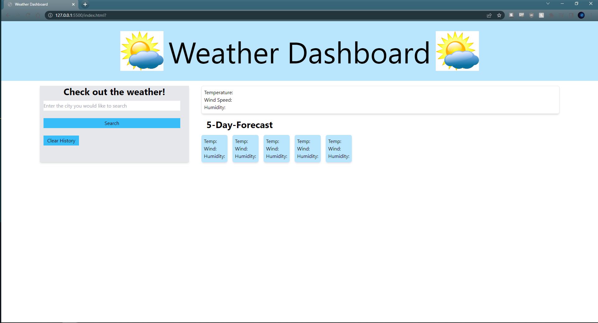
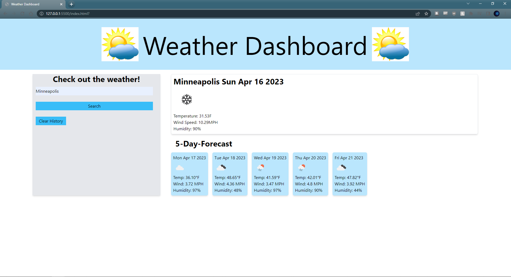

# weather-dashboard

## Description

This application is a weather dashboard that allows the user to search by city name and view the current weather, as well as a 5 day forecase. The date is displayed for all weather dates, as well as an image icon showing the forecasted weather conditions, temperature, humidity, and wind speed.

I used Tailwind CSS for the styling of this page. This was my first time using this CSS framework. Tailwind was connected via CDN so some feature may not be fully realized, but I enjoyed getting the chance to use something new.

This application makes use of the openweather api. I enjoyed the challenge of this application, and the complexity of building on my experience with Web API's in general.

## Installation

N/A

## Usage

To view the page, navigate to the below we address. You should be greeted with a webpage resembling the below screenshots.

https://nreece6.github.io/weather-dashboard/

Simply enter a city by name and the application will pull up the current weather and the 5-day forecast. Past searches should be saved below the search bar and able to be accessed again. At this time this feature is not working properly.

## Credits

Credit to GitHub user sahiljanbandhu for the For Loop used in the forecast portion of the application.

## License

---